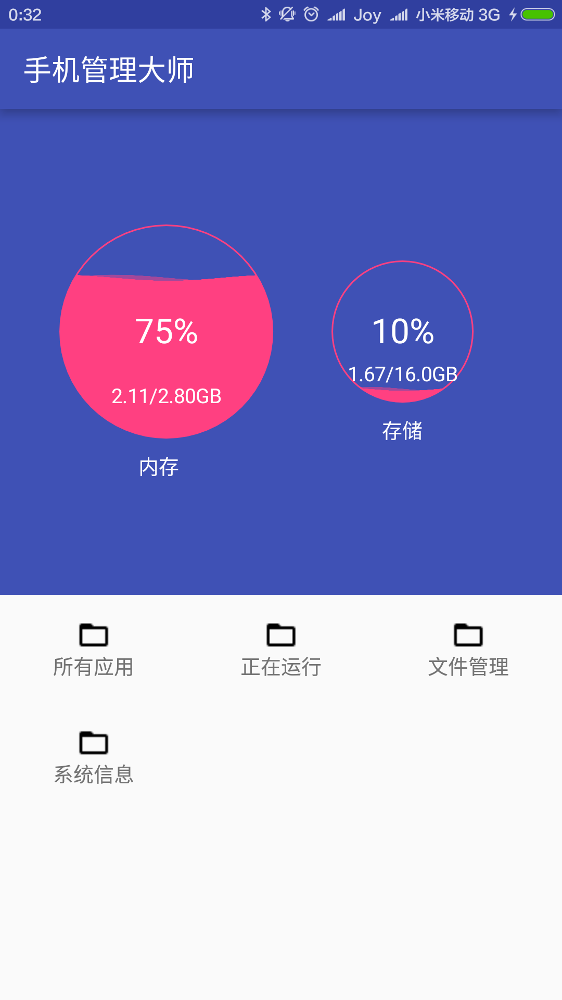

# PokeMaster

练手项目，主要功能是把手机内的某些信息采集并显示。

包括：

  * 所有安装的应用
  * 所有正在运行的进程
  * 所有文件
  * 某些系统信息
  * ...
  
  

使用的值得一提的技术：

  * ListView，以及它的ViewHolder优化技术
  * AsyncTask，子进程处理耗时非UI任务
  * TabLayout和ViewPager实现可以滑动的顶部Tab
  * PackageManager得到已安装的应用信息，ActivityManager获取正在运行的进程信息。
  * ...
  
使用的第三方库：

  * (WaveLoadingView)[https://github.com/tangqi92/WaveLoadingView]
  
  
 
 截图：
    
 